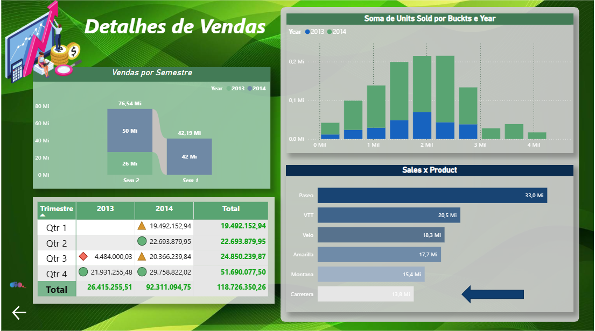

****📊 Relatório de Vendas e Lucros – Power BI****

****🎯 Objetivo****

Analisar vendas e lucros de forma visual e interativa para apoiar a tomada de decisão.

****🧩 Dados****

****Base: Financials****

Principais campos: Sales, Profit, Date, Year, Month, Segment e Country.

****🛠️ Etapas****

Tratamento dos dados no Power Query

Criação de colunas auxiliares (como período/semestre)

Construção de medidas para análise de vendas e lucro

****📈 Visualizações****

Colunas empilhadas → Vendas por semestre e ano

Gráfico de linha → Evolução das vendas

Cartões → Indicadores principais (Vendas e Lucro)

Segmentações → Filtros por ano, país e segmento

****📊 Resultado****

Comparação entre períodos

Identificação de tendências

Visão clara do desempenho de vendas e lucro

✔️ Conclusão

Relatório simples e eficiente, utilizando o Power BI para transformar dados em informações estratégicas para análise e tomada de decisão.
